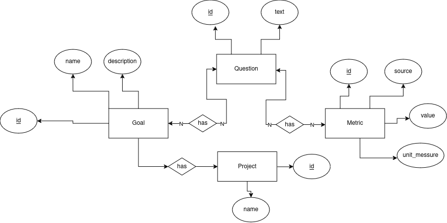
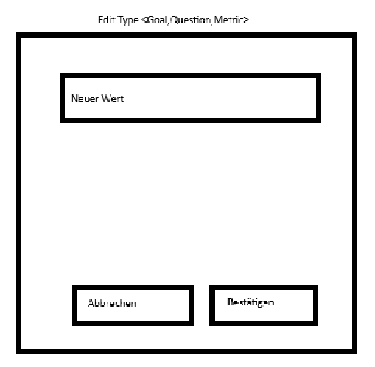
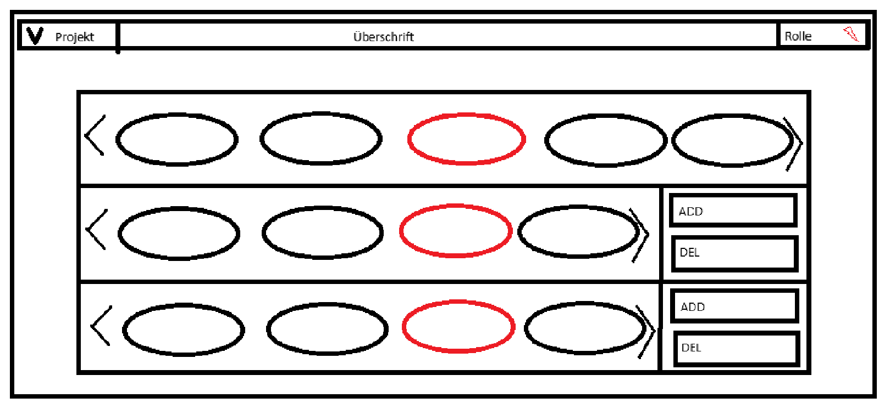
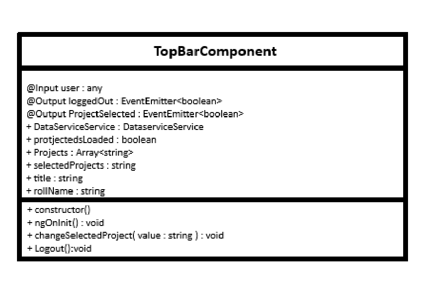
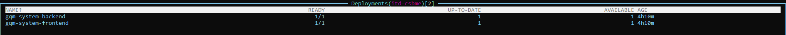
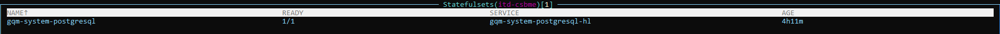
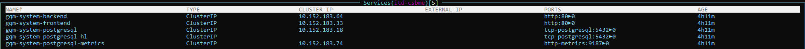
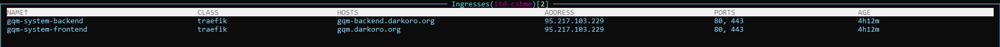

# GQM_CSBME
The best, blazingly fast solution for your GQM needs

## Planung 

### Verteilung
- Planung (Lasse)
- Frontend (Nico)
- Backend (Lucas)
- DevOps (Jean-Philippe)
- Design (Anton)

### Techstack

- PostgreSQL (Datenbank) 
- Kubernetes (Deployment)
  - Deployment (Front-/Backend)
  - Service (Front-/Backend)
  - Ingress (Frontend)
- Angular (Frontend)
- Postgraphile (Backend)

## Anforderungsanalyse (Nico, Lasse, Jean, Anton, Lucas)

[link zu anforderungstabelle](doku/anforderungstabelle)

## Ablaufdiagram (Lasse)

### ER-Diagramm (Lucas)

### Mockups (Nico)

### Wireframes (Philippe)

### UML Diagram (Nico)

#### Produktiv

**Backend**
https://gqm-backend.darkoro.org/

**Frontend**
https://gqm.darkoro.org/

#### Development
**Backend**
https://gqm-backend-dev.darkoro.org/

**Frontend**
https://gqm-dev.darkoro.org/

### Kubernetes
Diese App wird auf einem privaten Kubernetes-Cluster ausgerollt und ist öffentlich erreichbar.

Dafür wurde ein für diese Anwendungen entwickeltes [HelmChart](https://github.com/jpkraemer-mg/helmcharts/tree/main/charts/gqm) genutzt, welches sich um das Ausrollen des Front- und Backends sowie einer PostgreSQL-Datenbank kümmert.

In diesem Repository getätigte Änderungen triggern einen GitHub-Workflow, welcher Front- und Backend-Ordner (./FrontEnd-Angular/GQM/ bzw. ./go_backend/) auf Änderungen prüft und bei vorhandenen Änderungen ein neues Image baut.
Dieses jeweilige Image wird vom Kubernetes-Cluster durch die Nutzung des Flux Helm Controllers und der dort integrierten Image Update Automation automatisiert neu ausgerollt.

### Resourcen in der Einzelübersicht

