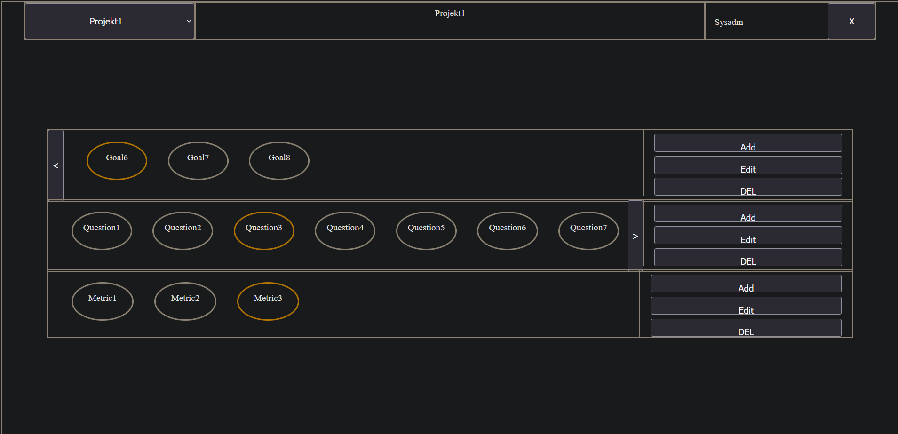

# GQM_CSBME
The best, blazingly fast solution for your GQM needs

## Planung
### Verteilung
- Planung (Lasse - nachträglich eingestiegen)
- Frontend (Nico)
- Backend (Lucas)
- DevOps bzw. CI/CD und allg. Unterstützung (Jean-Philippe)
- Qualitätsmanagement( Lucas )
- Design (Anton (Ursprünglich geplant), Jean-Philippe, Nico)

### Techstack
- PostgreSQL (Datenbank) 
- Kubernetes (Deployment)
  - Deployment (Front-/Backend)
  - Service (Front-/Backend)
  - Ingress (Frontend)
- GitHub (CI/CD, Security)
  - Renovate Bot (Security)
  - Workflow (CI/CD-Pipeline)
- Angular (Frontend)
- Postgraphile (Backend)
  - ursprünglich Go (Backend)

## Anforderungsanalyse (Nico, Lasse, Philippe, Anton, Lucas)
[Link zu Anforderungstabelle](doku/userstories.ods)

## Ablaufdiagramm (Lasse & Nico)
#### Nico

#### Lasse

### ER-Diagramm (Lucas)

### Wireframes (Nico, Philippe)

### Mockups (Nico, Philippe)

#### Nico

### UML Diagram (Nico)

### CI/CD und Systeme (Philippe)
### Produktiv
Backend < --- > https://gqm-backend.darkoro.org/

Frontend < --- > https://gqm.darkoro.org/

### Development
Backend < --- > https://gqm-backend-dev.darkoro.org/

Frontend < --- > https://gqm-dev.darkoro.org/

Diese App wird auf einem privaten Kubernetes-Cluster ausgerollt und ist öffentlich erreichbar.

Dafür wurde ein für diese Anwendungen entwickeltes [HelmChart](https://github.com/jpkraemer-mg/helmcharts/tree/main/charts/gqm) genutzt, welches sich um das Ausrollen des Front- und Backends sowie einer PostgreSQL-Datenbank kümmert.

In diesem Repository getätigte Änderungen triggern einen GitHub-Workflow, welcher Front- und Backend-Ordner (./FrontEnd-Angular/GQM/ bzw. ./go_backend/) auf Änderungen prüft und bei vorhandenen Änderungen ein neues Image baut.
Dieses jeweilige Image wird vom Kubernetes-Cluster durch die Nutzung des Flux Helm Controllers und der dort integrierten Image Update Automation automatisiert neu ausgerollt.

### Ressourcen in der Einzelübersicht

